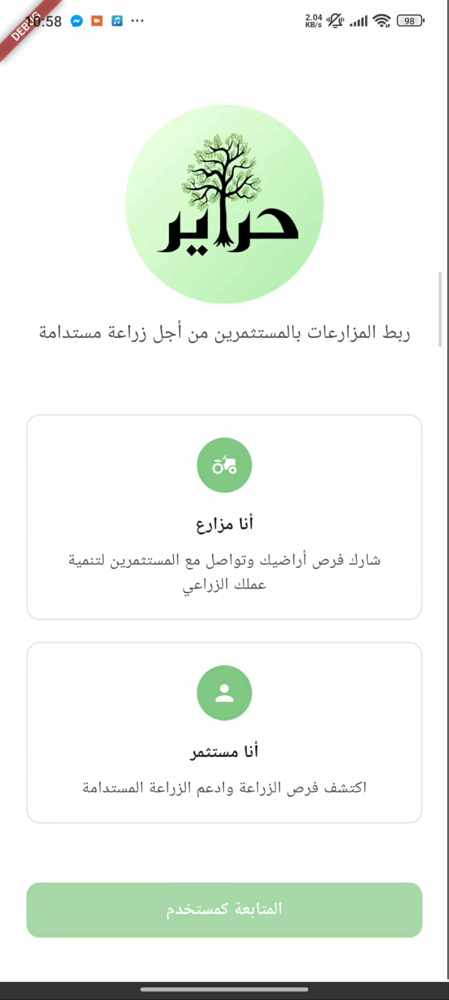
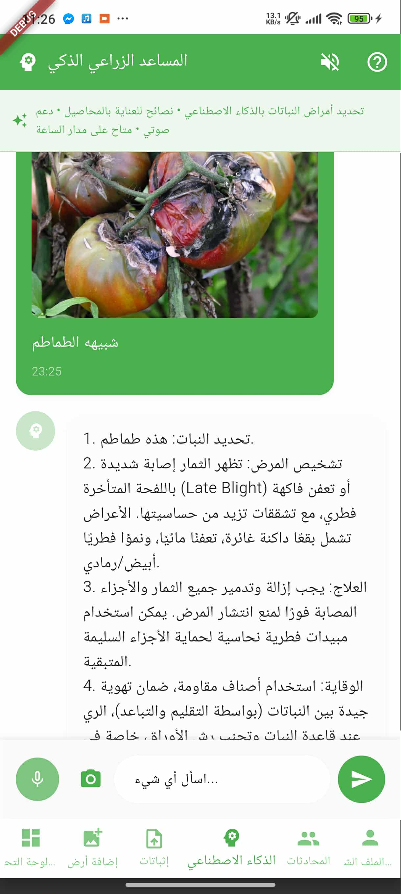
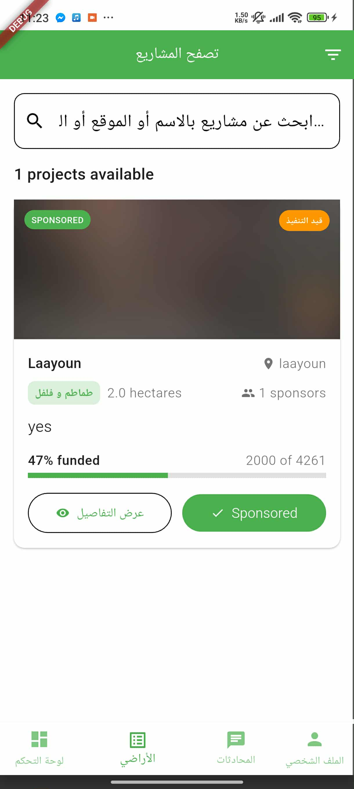
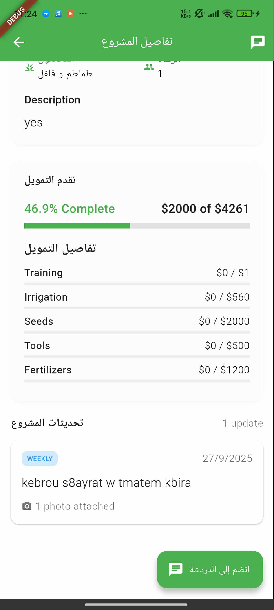
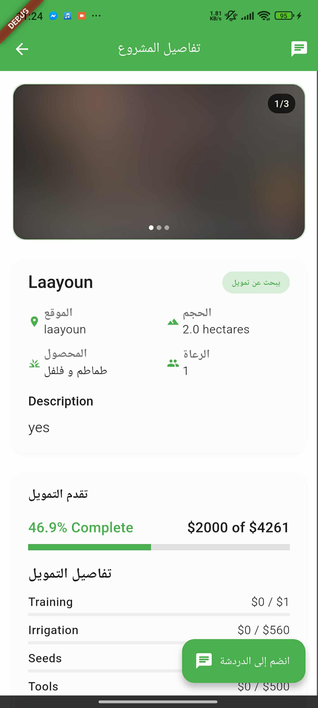
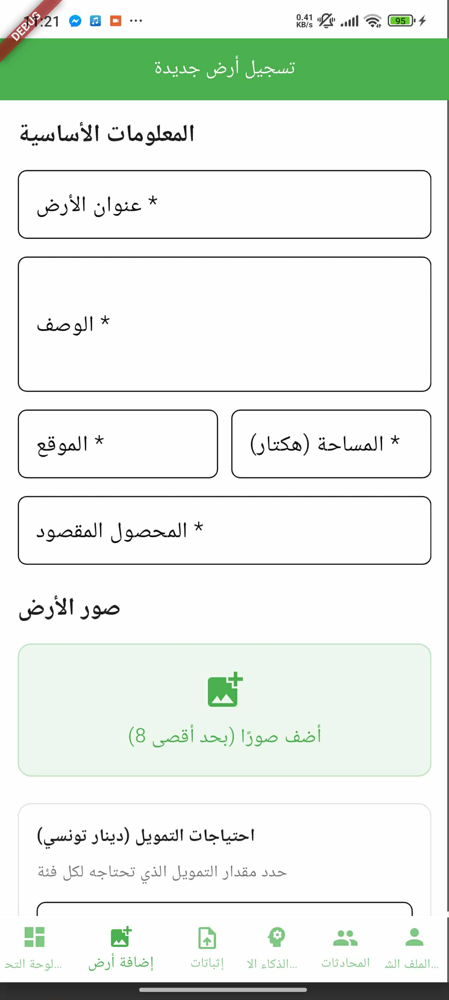
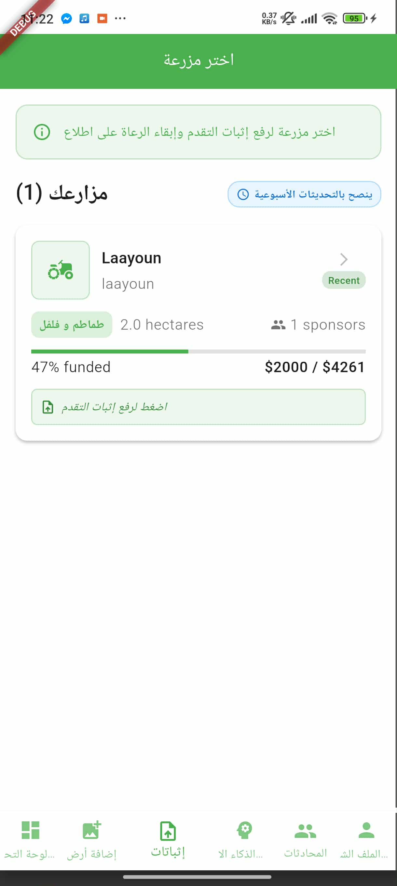
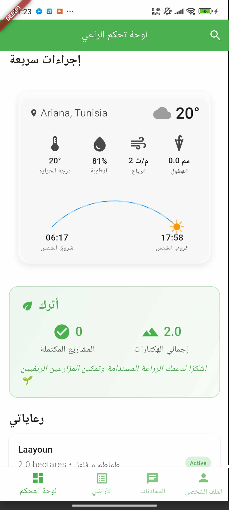

<a name="readme-top"></a>

<div align="center">

[![Contributors][contributors-shield]][contributors-url]
[![Forks][forks-shield]][forks-url]
[![Stargazers][stars-shield]][stars-url]
[![Issues][issues-shield]][issues-url]
[![MIT License][license-shield]][license-url]
[![LinkedIn][linkedin-shield]][linkedin-url]
</div>

---

# 🌾 Hrayer

**Empowering Rural Women Through Smart Agricultural Investment Platform with IoT Integration**
Built with ❤️ by [Nermine Ezzine](https://github.com/nermine-ezzine) & [Chater Marzougui](https://github.com/chater-marzougui).

<br />
<div align="center">
  <a href="https://github.com/chater-marzougui/Hrayer">
     
  </a>
  <h3>Hrayer</h3>
  <p align="center">
    <strong>Bridging the gap between smallholder farmers and investors through smart matchmaking, real-time IoT-based crop monitoring, and AI-powered assistance</strong>
    <br />
    <br />
    <a href="https://github.com/chater-marzougui/Hrayer/issues/new?labels=bug&template=bug-report---.md">Report Bug</a>
    ·
    <a href="https://github.com/chater-marzougui/Hrayer/issues/new?labels=enhancement&template=feature-request---.md">Request Feature</a>
      </p>
</div>

<br/>

---

<details>
  <summary>Table of Contents</summary>
  <ol>
    <li><a href="#about-the-project">About The Project</a></li>
    <li><a href="#-key-features">Key Features</a></li>
    <li><a href="#-project-objectives">Project Objectives</a></li>
    <li><a href="#-sustainable-development-goals">Sustainable Development Goals</a></li>
    <li><a href="#-expected-impact">Expected Impact</a></li>
    <li><a href="#-getting-started">Getting Started</a></li>
    <li><a href="#-technologies-stack">Technologies Stack</a></li>
    <li><a href="#️-installation">Installation</a></li>
    <li><a href="#-usage">Usage</a></li>
    <li><a href="#-configuration">Configuration</a></li>
    <li><a href="#-contributing">Contributing</a></li>
    <li><a href="#-license">License</a></li>
    <li><a href="#-contact">Contact</a></li>
    <li><a href="#-acknowledgments">Acknowledgments</a></li>
    <li><a href="#-interfaces">Interfaces</a></li>
  </ol>
</details>

<div align="right">
  <a href="#readme-top">
    
  </a>
</div>

---

## About The Project

**🚀 Hrayer** is an innovative agricultural platform designed to economically empower rural women farmers by bridging the gap between smallholder farmers and investors. Named after the Tunisian term for women of strength and wisdom, Hrayer addresses the unique challenges faced by women in agriculture including limited access to financial resources, exclusion from decision-making networks, restricted land ownership, and gaps in agricultural knowledge.

The platform creates a sustainable ecosystem that specifically uplifts women farmers while contributing to food security, rural development, and women's economic empowerment. The system integrates modern technologies including IoT sensors, machine learning, and mobile applications to provide comprehensive support throughout the agricultural cycle, with user-friendly interfaces designed for women with varying literacy levels.

### 🎯 Key Features

- 🤝 **Smart Farmer-Investor Matchmaking**: Transparent matchmaking system connecting farmers with investors through intelligent algorithms considering risk profiles, crop types, and geographic preferences
- 📡 **Real-Time IoT Crop Monitoring**: ESP8266-based sensor networks monitoring soil moisture, temperature, humidity, light intensity, and nutrient levels with automated alerts
- 🤖 **AI-Powered Multilingual Chatbot**: Voice-enabled assistant using Google Gemini-2.5-Flash for instant agricultural guidance supporting Arabic, French, and English with image analysis capabilities
- 💰 **Fair Profit & Impact Sharing**: Transparent profit distribution model ensuring women farmers retain control and ownership (20% base share + contribution-based bonuses)
- 🌐 **Mobile-First Design**: Cross-platform Flutter applications with offline capability and accessibility features for women with varying literacy levels
- 👥 **Community Building**: Peer support networks connecting women farmers for knowledge sharing and mutual support
- 🌍 **SDG Alignment**: Contributing to UN Sustainable Development Goals including No Poverty, Zero Hunger, Gender Equality, Decent Work, and Innovation

### 🎯 Project Objectives

- Develop a secure and transparent farmer-investor matchmaking system with priority access for women farmers
- Implement real-time crop monitoring using IoT sensors with user-friendly mobile interfaces
- Create an AI-powered multilingual chatbot with voice capabilities for instant agricultural assistance
- Establish a fair impact and profit-sharing model that ensures women farmers retain control and ownership
- Provide financial literacy training and business planning support specifically tailored for rural women
- Build community networks that connect women farmers for knowledge sharing and mutual support
- Contribute to UN SDGs: No Poverty (1), Zero Hunger (2), Gender Equality (5), Decent Work (8), and Innovation (9)

### 🌍 Sustainable Development Goals

Hrayer contributes to multiple UN SDGs:

- **SDG 1 (No Poverty)**: Increases farmer income through better access to capital
- **SDG 2 (Zero Hunger)**: Improves food security through optimized agriculture
- **SDG 5 (Gender Equality)**: Specifically empowers rural women farmers and addresses gender gaps in agriculture
- **SDG 8 (Decent Work)**: Creates economic opportunities in rural areas
- **SDG 9 (Innovation)**: Promotes agricultural innovation and infrastructure

### 📊 Expected Impact

- Increase farmer income through better access to funding and expert guidance
- Improve crop yields by up to 100% through optimized farming practices
- Reduce agricultural risks through early warning systems
- Create direct and indirect jobs for women and farmers
- Facilitate sustainable agricultural investments annually

<div align="right">
  <a href="#readme-top">
    
  </a>
</div>

---

## ⚡ Getting Started

### Prerequisites

Before you begin, ensure you have the following installed:

- **Flutter SDK** (version 3.0 or higher) - [Install Flutter](https://flutter.dev/docs/get-started/install)
- **Android Studio** or **Xcode** (for iOS development)
- **Git** for version control
- **Firebase account** for backend services
- A code editor like **VS Code** or **Android Studio**

### 🛠️ Technologies Stack

**Frontend:**
- Flutter (Cross-platform mobile framework)
- Dart programming language

**Backend:**
- Firebase Firestore (NoSQL database)
- Firebase Authentication (Phone number authentication)
- Firebase Cloud Messaging (Push notifications)
- Imgur API (Image storage)

**AI & IoT:**
- Google Gemini-2.5-Flash API (AI chatbot)
- ESP8266 microcontroller modules (IoT sensors)
- SIM800L GSM module (Cellular connectivity)
- DHT22, capacitive soil moisture, LDR, and nitrate sensors

### Installation

Follow these steps to set up the project locally:

```bash
# Step 1: Clone the repository
git clone https://github.com/chater-marzougui/Hrayer.git

# Step 2: Navigate to the project directory
cd Hrayer

# Step 3: Install Flutter dependencies
flutter pub get

# Step 4: Configure Firebase
# - Create a Firebase project at https://console.firebase.google.com
# - Download google-services.json (Android) and GoogleService-Info.plist (iOS)
# - Place them in the appropriate directories

# Step 5: Run the app
flutter run
```

\<div align="right"\>
  \<a href="\#readme-top"\>
    \
  \</a\>
\</div\>

-----

## 📚 Usage

### For Farmers

1. **Register Land**: Create a detailed project proposal including crop type, funding needs, and expected timeline
2. **IoT Monitoring**: Deploy sensor modules to track soil moisture, temperature, humidity, and nutrient levels
3. **Get Funding**: Match with investors based on your project requirements
4. **AI Assistance**: Use the voice-enabled chatbot for instant agricultural guidance in Arabic, French, or English
5. **Track Progress**: Share updates and photos with investors throughout the growing season

### For Investors

1. **Browse Projects**: Explore farming projects based on crop type, location, and investment amount
2. **Real-Time Monitoring**: Track crop health and environmental conditions via IoT dashboard
3. **Transparent Returns**: View profit-sharing terms and expected returns upfront
4. **Impact Tracking**: Monitor the social and environmental impact of your investments

```bash
# Example: Running the mobile app in debug mode
flutter run

# Build for Android
flutter build apk --release

# Build for iOS
flutter build ios --release
```

\<div align="right"\>
  \<a href="\#readme-top"\>
    \
  \</a\>
\</div\>

-----

## 🪛 Configuration

### Environment Variables

Create a `.env` file in the root directory with the following configuration:

```env
# Firebase Configuration
FIREBASE_API_KEY=your_firebase_api_key
FIREBASE_PROJECT_ID=your_project_id
FIREBASE_MESSAGING_SENDER_ID=your_sender_id
FIREBASE_APP_ID=your_app_id

# Gemini AI Configuration
GEMINI_API_KEY=your_gemini_api_key

# Imgur Configuration
IMGUR_CLIENT_ID=your_imgur_client_id
```

### Firebase Setup

1. Create a Firebase project at [Firebase Console](https://console.firebase.google.com)
2. Enable Firestore Database
3. Enable Firebase Authentication (Phone Number sign-in)
4. Enable Firebase Cloud Messaging
5. Download configuration files and add to your project

### IoT Sensor Configuration

For farmers using IoT sensors:

1. Configure ESP8266 modules with your WiFi/GSM credentials
2. Set up SIM800L module with a valid SIM card for cellular connectivity
3. Deploy sensors in designated farm plots
4. Sensors will automatically transmit data every 30 minutes

\<div align="right"\>
  \<a href="\#readme-top"\>
    \
  \</a\>
\</div\>

-----

## 🤝 Contributing

Contributions are what make the open source community amazing\! Any contributions are **greatly appreciated**.

### How to Contribute

1.  **Fork the Project**
2.  **Create your Feature Branch** (`git checkout -b feature/AmazingFeature`)
3.  **Commit your Changes** (`git commit -m 'Add some AmazingFeature'`)
4.  **Push to the Branch** (`git push origin feature/AmazingFeature`)
5.  **Open a Pull Request**

\<div align="right"\>
  \<a href="\#readme-top"\>
    \
  \</a\>
\</div\>

-----

## 📃 License

Distributed under the MIT License. See `LICENSE` for more information.

\<div align="right"\>
  \<a href="\#readme-top"\>
    \
  \</a\>
\</div\>

-----

## 📧 Contact

**Nermine Ezzine** - [@nermine-ezzine](https://github.com/nermine-ezzine)

**Chater Marzougui** - [@chater-marzougui](https://github.com/chater-marzougui) - [LinkedIn](https://www.linkedin.com/in/chater-marzougui-342125299/)

Project Link: [https://github.com/chater-marzougui/Hrayer](https://github.com/chater-marzougui/Hrayer)

-----

## 🙏 Acknowledgments

We would like to thank the following for their support and inspiration:

- **IEEE Sup'Com Student Branch** for providing the platform and resources to develop this project
- The rural women farmers who shared their insights and challenges
- Agricultural experts and advisors who guided our technical approach
- The open-source community for the amazing tools and libraries
- UN FAO for research and data on women in agriculture
- All contributors and supporters of the Hrayer platform

This project is dedicated to empowering rural women farmers and contributing to sustainable agricultural development.

\<div align="right"\>
  \<a href="\#readme-top"\>
    \
  \</a\>
\</div\>

-----

**"Hrayer" - Empowering the women of strength and wisdom who are the backbone of rural agriculture.**


[contributors-shield]: https://img.shields.io/github/contributors/chater-marzougui/Hrayer.svg?style=for-the-badge
[contributors-url]: https://github.com/chater-marzougui/Hrayer/graphs/contributors
[forks-shield]: https://img.shields.io/github/forks/chater-marzougui/Hrayer.svg?style=for-the-badge
[forks-url]: https://github.com/chater-marzougui/Hrayer/network/members
[stars-shield]: https://img.shields.io/github/stars/chater-marzougui/Hrayer.svg?style=for-the-badge
[stars-url]: https://github.com/chater-marzougui/Hrayer/stargazers
[issues-shield]: https://img.shields.io/github/issues/chater-marzougui/Hrayer.svg?style=for-the-badge
[issues-url]: https://github.com/chater-marzougui/Hrayer/issues
[license-shield]: https://img.shields.io/github/license/chater-marzougui/Hrayer.svg?style=for-the-badge
[license-url]: https://github.com/chater-marzougui/Hrayer/blob/master/LICENSE.txt
[linkedin-shield]: https://img.shields.io/badge/-LinkedIn-black.svg?style=for-the-badge&logo=linkedin&colorB=555
[linkedin-url]: https://www.linkedin.com/in/chater-marzougui-342125299/

---

## 🖥️ Interfaces

### Mobile Application

#### Farmer Interface
<div align="center">
  
</div>

#### Chatbot
<div align="center">
  
</div>

#### Investor Interface
<div align="center">
  
  
  
</div>

#### Farmer Interface
<div align="center">
  
  
</div>

### IoT Dashboard
<div align="center">
  

<div align="right">
  <a href="#readme-top">
    
  </a>
</div>

